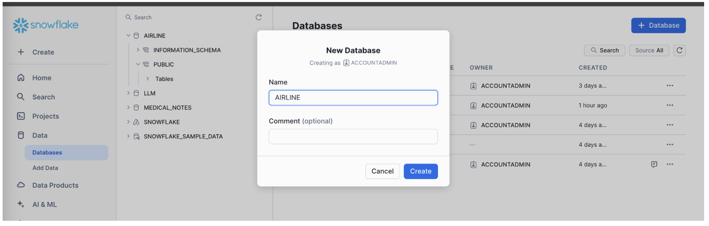
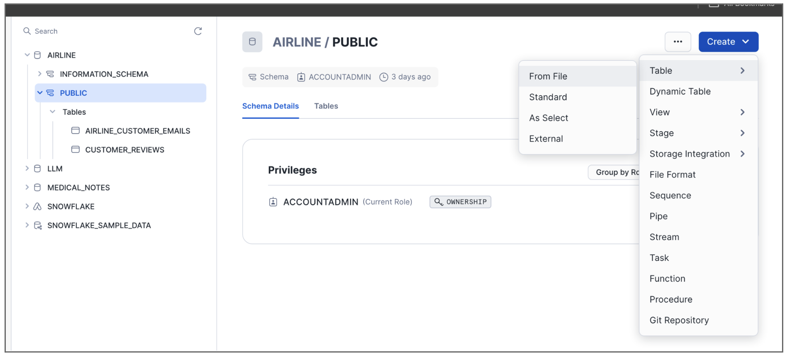
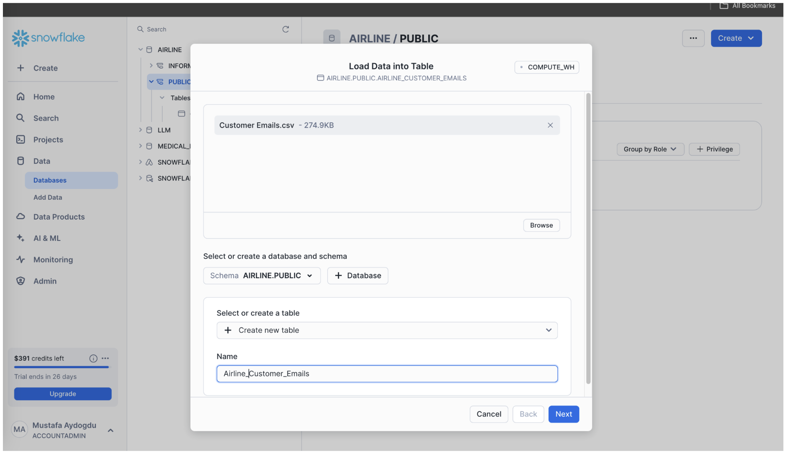
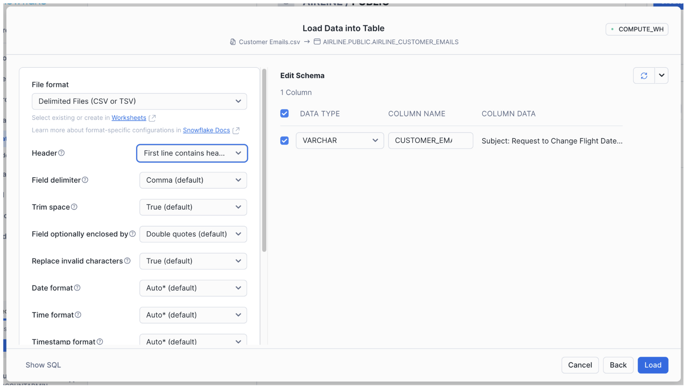

## **Customer Email Analysis With Cortex**

Create your trial account via below link.  
[https://signup.snowflake.com/](https://signup.snowflake.com/)

**Edition:** Enterprise  
**Region:** Azure East US 2 (Virginia)


Download Sample Emails  
[https://github.com/mydgd/files/blob/main/Customer%20Emails.csv](https://github.com/mydgd/files/blob/main/Customer%20Emails.csv)

Create a new database named AIRLINE  


Select Public schema and create table from file.  


Upload “Customer Emails.csv” and create a table named Airline\_Customer\_Emails.


Don’t forget to set the Header for first line from the options.  


Open a worksheet and run below SQL to process data with Cortex Functions. Please not that there are 2 different prompts. Try them one by one.

```
USE AIRLINE.PUBLIC;
-- View Data
SELECT * FROM AIRLINE_CUSTOMER_EMAILS;

SET PROMPT='Deduct the PII (names, addresses, email addresses, phone numbers, credit card numbers) from this customer email. Only respond with the email text including reducted PII. Dont start with Here is the email. The email: ';

SET PROMPT='what is the address in this email: ';

SELECT CUSTOMER_EMAIL
, SNOWFLAKE.CORTEX.SENTIMENT(CUSTOMER_EMAIL) Sentiment
, SNOWFLAKE.CORTEX.CLASSIFY_TEXT(CUSTOMER_EMAIL, ['payment', 'luggage', 'delay']) Category
, SNOWFLAKE.CORTEX.COMPLETE('llama3.1-70b', CONCAT($PROMPT, CUSTOMER_EMAIL)) LLM_Response
FROM AIRLINE_CUSTOMER_EMAILS LIMIT 5;
```
